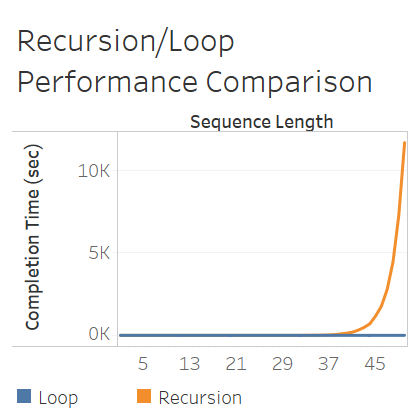

# Day 22: Recursive Functions
**Instructions:** 
1. Open a new python file.
2. Recursive functions are ones that call on themselves to produce additional results. Most recursive problems can be solved using loops, but it is important to understand the functionality. Before the invention of loops in programming languages, recursion was the best way to solve problems like the Fibonacci Sequence or factorials programmatically. A factorial is the product of all numbers from 1 to N (e.g. 3! = 3 * 2 * 1). This can also be written as 3 * 2!. The factorial of 0 or 1 returns 1, so this can be explicitly called in the function. The recursion function determines the highest numerical value in each iteration and adds it to the list of items to multiply. Then it executes the function again with one less the previous number until 1 or 0 is reached. Similarly, the same results can be obtained by using a `for` loop. The loop requires more lines of code, but it is often more easily readable than recursive functions.
    ```
    def factorial(n: int) -> int:
    """
    Calculate the factorial of an integer greater than zero.
    :param n: Must be an integer greater than zero.
    :return: The integer value of N!
    """
    if n < 0:
        print("n must be a positive number. {} is an invalid response.".format(n))
        exit(code=1)
    if n in (0, 1):
        return 1
    return factorial(n - 1) * n


    n = int(input("Provide an integer for factorial calculation: "))
    
    soln = 1
    for i in range(0, n + 1):
        if n < 0:
            print("n must be a positive number. {} is an invalid response.".format(n))
            break
        if i in (0, 1):
            soln = 1
            continue
        soln *= i

    print("""{}!
    Recursion Results: {}
    Loop Results: {}""".format(n, factorial(n), soln))
    ```
3. Performance between loops and recursion
    ```
    import time


    def fibonacci(n: int) -> int:
        """
        The Fibonacci sequence is a list of numbers where the subsequent number is the sum of the previous two.
        :param n: The number of items requested for the Fibonacci sequence.
        :return: The Fibonacci number at position n
        """
        if n <= 0:
            raise ValueError("The number must be greater than zero.")
            exit(code=1)
        if n == 1:
            return 0
        elif n == 2:
            return 1
        else:
            return fibonacci(n-1) + fibonacci(n - 2)


    fib_length = int(input("How long do you want the Fibonacci sequence? "))
    loop_start = time.time()
    # List contains the static first two items in the Fibonacci sequence.
    output = [0, 1]

    if fib_length < 2:
        if fib_length == 2:
            print("Fibonacci Sequence with Length: {}\n{}".format(fib_length, output))
        elif fib_length == 1:
            print("Fibonacci Sequence with Length: {}\n{}".format(fib_length, output[0]))
        else:
            print("The range of the Fibonacci sequence must be greater than zero.")
            exit(code=42)

    for i in range(1, fib_length):
        output.append(output[i-1] + output[i])

    print("Loop Performance Test")
    for k in range(0, len(output) - 1):
        print("{}: {}".format(k + 1, output[k]))
    loop_end = time.time()
    loop_sec = loop_end - loop_start
    print("Loop Execution Time: {} sec".format(loop_sec))

    print("")
    print("=" * 100)
    print("")

    print("Recursion Performance Test")
    recursion_start = time.time()
    for n in range(1, fib_length + 1):
        print("{}: {}".format(n, fibonacci(n)))
    recursion_end = time.time()
    recursion_sec = recursion_end - recursion_start
    print("Recursion Execution Time: {} sec".format(recursion_sec))
    print("=" * 50)
    print("The recursive function took {} sec longer than the loop.".format(recursion_sec - loop_sec))
    ```
4. Displaying the first 50 values in the Fibonacci sequence with a loop only takes 0.001 seconds. However, completing the same task with a recursive function takes 3 hours 14 minutes. This is because the loop created is only a single level and therefore can complete the task extremely efficiently. However, the recursive function does not store the previous values executed, so as the number of items increases, it exponentially increases the processing time. By running `fibonacci(10)`, the function needs to run `fibonacci(9)` and `fibonacci(8)`. However, now the program needs to run `fibonacci(8)`,`fibonacci(7)`, `fibonacci(7)`, `fibonacci(6)`. This continues until the lowest level of recursion where the value equals 1. Therefore, to calculate the next level of the fibonacci sequence, the computer needs to work incredibly hard to figure out how many ones to add together.  
    
    ```
    fibonacci(10) = fibonacci(9) + fibonnacci(8)
                  = fibonacci(8) + fibonacci(7) + fibonacci(7) + fibonacci(6)
                  = fibonacci(7) + fibonacci(6) + fibonacci(6) + fibonacci(5) + fibonacci(6) + fibonacci(5) + fibonacci(5) + fibonacci(4)
                  etc.
                  = fibonacci(1) + fibonacci(1) + fibonacci(1) + ... + fibonacci(1)
                  = 34
    ```
5. This can be remedied by using memoization. Memoization is simply caching the previous values so it can be accessed in subsequent calls. This is seen in the method the `for` loop was created. By saving each value to a list, the previous two values can be quickly and efficiently accessed to calculate the subsequent value in the sequence. By implementing memoization, the recursive function took 0.001 seconds to calculate the first 50 values.
    ```
    import time
    
    cache = {}


    def fibonacci(n: int) -> int:
        """
        The Fibonacci sequence is a list of numbers where the subsequent number is the sum of the previous two. Memoization
        is added as an enhancement (in the form of a dictionary) to efficiently record and retrieve previously calculated
        values of the Fibonacci sequence.
        :param n: The number of items requested for the Fibonacci sequence.
        :return: The Fibonacci number at position n
        """
        # Looks for a cached value and returns it if found.
        if n in cache:
            return cache[n]
    
        if n <= 0:
            raise ValueError("The number must be greater than zero.")
            exit(code=1)
        if n == 1:
            return 0
        elif n == 2:
            return 1
        else:
            result = fibonacci(n-1) + fibonacci(n - 2)
        
        # Add the result to the cache
        cache[n] = result
        return result


    recursion_start = time.time()
    for n in range(1, fib_length + 1):
        print("{}: {}".format(n, fibonacci(n)))
    recursion_end = time.time()
    recursion_sec = recursion_end - recursion_start
    print("Recursion Execution Time: {} sec".format(recursion_sec))
    ```
6. There is a hard cap on the number of recursions allowed and this can be identified by running the `.getrecursionlimit()` function. Programs that try to execute higher than the recursion limit will fail.
    ```
    import sys
    print(sys.getrecursionlimit())
    ```
7. Additionally, the recursion limit can be manually set using the `.setrecursionlimit()` function based on the program limitations.
    ```
    import sys
    sys.setrecursionlimit(100)
    print(sys.getrecursionlimit())
    ``` 
8. Update the [log file](../../log.md) with what you have learned today.
