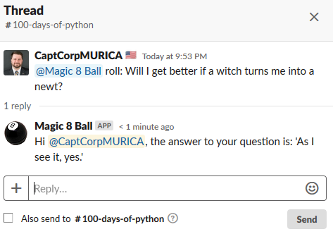

# Day 41: Creating a Chatbot
**Instructions:** 
1. Open a new python file.
2. Slack is a common messaging app that is used in many technology companies today. Building a bot user provides the opportunity for substantially more advanced functionality, including AI integration. Follow the [enabling interactions with bots](https://api.slack.com/bot-users) documentation to create the Slack Bot User and establish the API codes.
3. The [slackclient](https://pypi.org/project/slackclient/) package provides an easy connection and interaction interface to the Slack API.
    ```
    import slack
    import random
    ```
4. A simple function is created to generate a random number between 1 and 20 and then return the corresponding response from the Magic 8 Ball.
    ```
    def magic_8_ball():
        """
        Selects a random number between 1 and 20 and then returns the text output from the Magic 8 Ball.
        :return: Magic 8 Ball result
        """
        ball = {1: "It is certain.",
                2: "It is decidedly so.",
                3: "Without a doubt.",
                4: "Yes - definitely.",
                5: "You may rely on it.",
                6: "As I see it, yes.",
                7: "Most likely.",
                8: "Outlook good.",
                9: "Yes.",
                10: "Signs point to yes.",
                11: "Reply hazy, try again.",
                12: "Ask again later.",
                13: "Better not tell you now.",
                14: "Cannot predict now.",
                15: "Concentrate and ask again.",
                16: "Don't count on it.",
                17: "My reply is no.",
                18: "My sources say no.",
                19: "Outlook not so good.",
                20: "Very doubtful."}

        choice = random.randint(1, 20)
        return ball[choice]
    ```
5. A function is created to parse the data received when a direct mention is made. The data from a message (`payload`) is received as a dictionary. Therefore, specific elements from the message are easily able to be parsed and leveraged for the bot's actions. If `roll` is found in the text of the data, a message is compiled and the `magic_8_ball()` function is called. This then posts the message using the `.chat_postMessage()` function as a thread of the original message. If the bot received a direct message containing the phrase `shut down bot`, then the program terminates. The `KeyError` exception is added to keep the bot active after a message is sent.
    ```
    @slack.RTMClient.run_on(event='message')
    def roll_ball(**payload):
        data = payload["data"]
        web_client = payload["web_client"]
        rtm_client = payload["rtm_client"]
        try:
            if "roll" in data["text"].lower():
                channel_id = data["channel"]
                thread_ts = data["ts"]
                user = data["user"]

                web_client.chat_postMessage(
                    channel=channel_id,
                    text=f"Hi <@{user}>, the answer to your question is: '{magic_8_ball()}'",
                    thread_ts=thread_ts
                    )
            elif "shut down bot" in data["text"].lower():
                channel_id = data["channel"]
                thread_ts = data["ts"]
                user = data["user"]

                web_client.chat_postMessage(
                    channel=channel_id,
                    text=f"Hi <@{user}>, I will now go to sleep.",
                    thread_ts=thread_ts
                )
                exit(0)
        except KeyError:
            pass
    ```
6. While it is preferred to add the `slack_bot_token` as a system environment variable, this method of credential retrieval is acceptable for local testing. The slack token is used to create the Real Time Messaging (RTM) client through the `.RTMClient()` function. The `.start()` function activates the client and keeps the connection open until the python program is terminated. This ensures that the Magic 8 Ball bot can provide multiple responses without needing to be restarted.
    ```
    if __name__ == '__main__':
        credentials = dict()
        with open("credentials.txt", "r") as cred:
            for line in cred:
                var, val = line.split(": ")
                credentials[var] = val.rstrip("\n")
                var = ""
                val = ""
                line = ""

        slack_token = credentials["slack_bot_token"]
        credentials.clear()
        rtm_client = slack.RTMClient(token=slack_token)
        slack_token = ""
        rtm_client.start()
    ```
7. Once the application is running, the bot can be activated through a direct mention and using the keyword `roll`. The bot will respond directly to the message with the result from the Magic 8 Ball.  
    
8. Update the [log file](../../log.md) with what you have learned today.